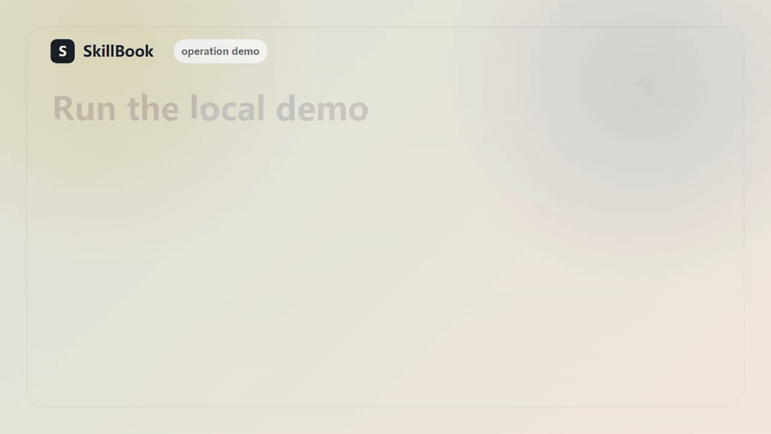

# SkillBook

Teach your AI agents what to remember, what to reject, and how to evolve.

[](https://github.com/wanghaoxiang6/skillbook/actions/workflows/ci.yml)

SkillBook is a local-first CLI that turns articles, repos, feedback, and project context into reviewed AI Skill updates. It does not blindly summarize sources or dump everything into memory. It builds proposals first.



[Watch the MP4 version](docs/assets/skillbook-demo.mp4)

```txt
User profile + project context + skill gaps
-> library recommendations
-> source cards
-> update proposals
-> human review
-> versioned Skill updates
```

## Why

AI agents get worse when they remember everything.

SkillBook gives them a safer loop:

- learn the user first
- search public GitHub when reuse is likely
- inspect sources before absorbing them
- separate rules, examples, evals, warnings, and references
- require proposals before durable memory or Skill updates
- evolve from evidence, not vibes

## Quick Demo

```bash
npm install
npm run build
npx tsx src/cli.ts demo
npx tsx src/cli.ts status
npx tsx src/cli.ts doctor
```

The demo creates:

- a profile evolution proposal
- a public-library recommendation report
- a Source Card
- an Update Proposal

## Project Links

- [Roadmap](ROADMAP.md)
- [Demo notes](docs/demo.md)
- [Launch post drafts](docs/launch-posts.md)
- [Real intake case: basic-memory-skills](examples/basic-memory-skills-case.md)

## First Real Use

```bash
npm install
npm run build
npm link

skillbook init
skillbook onboard
skillbook interview
skillbook profile
skillbook gaps
skillbook recommend-libs --from-profile --from-gaps
skillbook intake ./sources/raw/example.md
```

## Example

Before:

```txt
I found a good README. Should I save it?
```

Run:

```bash
skillbook intake ./sources/raw/repo-readme.md
```

Output:

```txt
sources/cards/repo-readme.source_card.md
proposals/intake/repo-readme.update_proposal.md
```

Proposal shape:

```yaml
decision: partial_accept
recommended_targets:
  - skill_id: open-source-repo-analysis
    action: add_eval
accepted_items:
  rules:
    - Do not execute external repository scripts during analysis.
  evals:
    - Apply must create a draft update instead of modifying formal Skills.
rejected_items:
  - item: hosted database layer
    reason: v1 is local-first and file-based.
```

## Core Workflows

### Learn The User

```bash
skillbook interview
skillbook reflect
skillbook profile-apply ./proposals/profile/xxx.profile_evolution_proposal.md
```

`interview` creates a profile proposal. `reflect` infers profile updates from local project files and logs. `profile-apply` writes only after user confirmation.

### Recommend Libraries

```bash
skillbook recommend-libs --goal "build an AI memory system"
skillbook recommend-libs --from-profile
skillbook recommend-libs --from-gaps
```

Output:

```txt
recommendations/libs/*.library_recommendation.md
```

Reports include fit, stage, complexity, license, stars, last-updated signal, risks, and next step.

### Intake A Source

```bash
skillbook intake ./sources/raw/article.md
```

Output:

```txt
sources/cards/*.source_card.md
proposals/intake/*.update_proposal.md
```

### Record Evidence

```bash
skillbook correction "Do not start with Web UI by default"
skillbook feedback "This library recommendation is too heavy for my stage"
skillbook repeated "I keep asking about SEO and Reddit growth"
```

These logs become evidence for future profile, Skill, and prompt evolution.

### Evolve A Skill

```bash
skillbook log --skill ai-coding-debugging --result failure
skillbook evolve ai-coding-debugging
```

## Commands

- `skillbook init`
- `skillbook onboard`
- `skillbook demo`
- `skillbook doctor`
- `skillbook status`
- `skillbook interview`
- `skillbook profile`
- `skillbook reflect`
- `skillbook profile-propose`
- `skillbook profile-apply <proposal>`
- `skillbook gaps`
- `skillbook recommend-libs`
- `skillbook correction <text>`
- `skillbook feedback <text>`
- `skillbook repeated <text>`
- `skillbook analyze <source>`
- `skillbook intake <source>`
- `skillbook match <source_card>`
- `skillbook propose <source_card>`
- `skillbook apply <proposal>`
- `skillbook log --skill <id> --result success|failure`
- `skillbook evolve <skill>`
- `skillbook export --target claude|chatgpt|cursor|codex|gemini`

## Project Structure

```txt
memory/              user profile, focus, gaps, decisions
indexes/             skill tree, skill index, source index
skills/              versioned Skill packages
sources/raw/         original user-provided sources
sources/cards/       generated Source Cards
proposals/intake/    Update Proposals
proposals/profile/   Profile Evolution Proposals
proposals/evolution/ Skill Evolution Proposals
recommendations/     public-library recommendation reports
logs/                usage, failures, corrections, feedback
templates/           reusable markdown/yaml templates
prompts/             future LLM prompt specs
src/                 TypeScript CLI and core logic
tests/               Vitest coverage
```

## Privacy Defaults

- No private GitHub repositories are read by default.
- No GitHub token is required by default.
- Library Scout uses public GitHub search and curated fallback candidates.
- Recommended repositories are not cloned or executed.
- `.env` and credential files are not read.
- Durable memory updates require explicit apply commands.

## Not For

- Auto-saving every interesting source
- Replacing human review
- Secret management
- Private GitHub mining
- Running third-party repo scripts
- Turning inspiration into rules without tests

## Development

```bash
npm install
npm run build
npm test
npm run typecheck
```

## License

MIT
